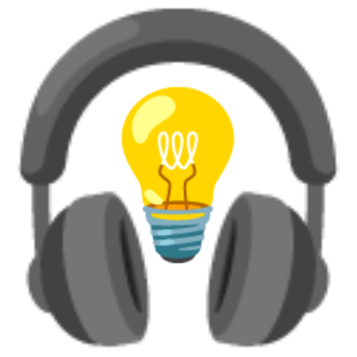

<h1 align="center">AudibleLight</h1>

<p align="center">
<a href="https://github.com/AudibleLight/AudibleLight"></a>
</p>

<h2 align="center">A Controllable, End-to-End API for Soundscape Synthesis Across Ray-Traced & Real-World Measured Acoustics</h2>

<p align="center">
<a href="https://github.com/AudibleLight/AudibleLight/actions"></a>
<a href="https://github.com/AudibleLight/AudibleLight/actions"></a>
<a href="https://codecov.io/gh/AudibleLight/AudibleLight"></a>
<a href="https://www.linux.org"></a>
<a href="https://www.python.org/"></a>
<a href="https://github.com/psf/black"></a>
<a href="https://github.com/AudibleLight/AudibleLight/pulls"></a>
<a href="https://creativecommons.org/licenses/by/4.0/"></a>
</p>

> [!WARNING]
> *This project is currently under heavy development*. We have done our due diligence to ensure that it works as expected. However, if you encounter any errors, please [open an issue](https://github.com/AudibleLight/AudibleLight/issues) and let us know.

**Contents**
- [Installation](#installation)
- [Usage](#usage)
- [Contributions](#contributions)
- [Roadmap](#roadmap)

## What is `AudibleLight`?

`AudibleLight` is a unified API for soundscape synthesis supporting ray-traced, real-world, and parametric RIR generation. It enables flexible microphone array modeling and dynamic, fully annotated source trajectories within a single workflow. It is built upon [`SpatialScaper`](https://github.com/marl/SpatialScaper), [`SoundSpaces`](https://github.com/facebookresearch/sound-spaces) and [`Pyroomacoustics`](https://github.com/LCAV/pyroomacoustics) for scalable soundscape generation with unprecedented acoustic diversity.

`AudibleLight` is developed by researchers at the [Centre for Digital Music, Queen Mary University of London](https://www.c4dm.eecs.qmul.ac.uk/) in collaboration with [Meta Reality Labs](https://www.meta.com/en-gb/emerging-tech).

## Installation:

### Prerequisites

- `git`
- `python3.10` or above (tested up to `python3.12`)
- `poetry`
- `make`
- A modern Linux distro: current versions of `Ubuntu` and `Red Hat` have been tested and confirmed to work.
  - Using another OS? Let us know so we can add it here!

### Install via the command line

```bash
git clone https://github.com/AudibleLight/AudibleLight.git
cd AudibleLight
make install
```

### Download datasets

We provide several helper scripts to download and prepare data (3D meshes, sofa files, audio files) that may be useful in `AudibleLight`. To run these:

```bash
make download
```

For further information, see [scripts/download_data/README.md](scripts/download_data/README.md).

## Usage

### Script

We include scripts to generate large datasets for common tasks relating to spatial soundscape synthesis.

To generate a dataset for sound event localization and detection (**SELD**) that conforms with the [DCASE2023 task 3](https://dcase.community/challenge2023/task-sound-event-localization-and-detection-evaluated-in-real-spatial-sound-scenes) format, run:
```bash
poetry run python scripts/seld/generate_dataset.py
```

To see the available arguments that this script takes, add the `--help` argument

If you want to generate custom datasets (or want to implement `AudibleLight` in a larger pipeline), please see the [quickstart](https://audiblelight.github.io/AudibleLight/_examples/quickstart.html), [tutorials](https://audiblelight.github.io/AudibleLight/_examples/1.0.0_make_scene.html), and [API documentation](https://audiblelight.github.io/AudibleLight/core.html).

## Contributions

... are welcome! Please [make a PR](https://github.com/AudibleLight/AudibleLight/pulls) or take a look [at the open issues](https://github.com/AudibleLight/AudibleLight/issues).

### Running the tests

Before making a PR, ensure that you run the pre-commit hooks and tests:

```bash
make fix
make tests
```

## Roadmap

- Spatial audio augmentations (from https://arxiv.org/abs/2101.02919)
- Add to `pypi` (i.e., allowing `pip install audiblelight`)
- HRTF support
- Directional microphone capsules support
- Increased visualisation options

### API Sketch


